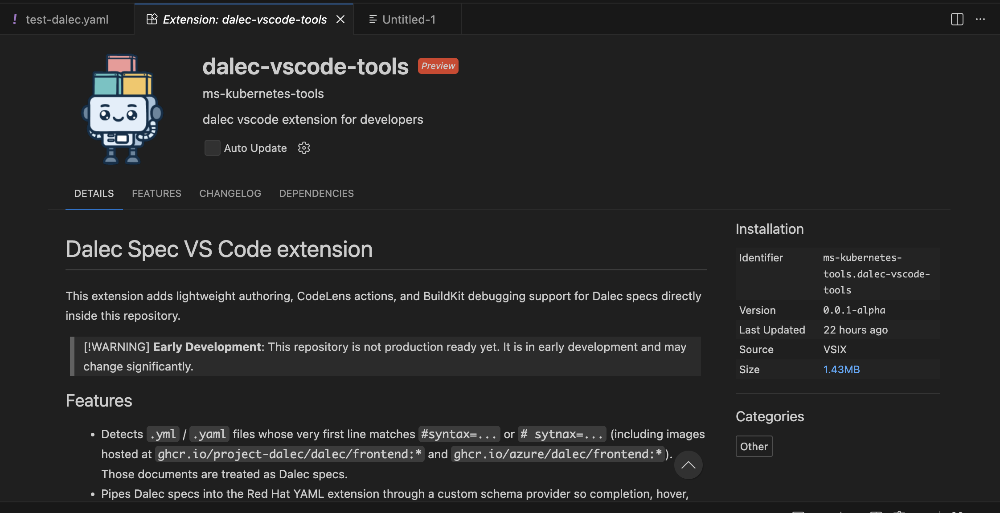

# Dalec Spec VS Code extension

This extension adds lightweight authoring, CodeLens actions, and BuildKit debugging support for Dalec specs directly inside this repository.

> [!WARNING]
> **Early Development**: This repository is not production ready yet. It is in early development and may change significantly.

## Features

- Detects `.yml` / `.yaml` files whose very first line matches `#syntax=...` or `# syntax=...` (including images hosted at `ghcr.io/project-dalec/dalec/frontend:*` and `ghcr.io/azure/dalec/frontend:*`). Those documents are treated as Dalec specs.
- Pipes Dalec specs into the Red Hat YAML extension through a custom schema provider so completion, hover, and validation use `docs/spec.schema.json` from the current workspace (falling back to a vendored copy when necessary).
- Adds a `dalec-buildx` debug type (currently disabled by default; set `DALEC_ENABLE_DEBUG=1` before launching VS Code to opt in) that shells out to `BUILDX_EXPERIMENTAL=1 docker buildx dap build --target <target> -f <spec file> <context>` so you can start BuildKit debug sessions straight from VS Code. Breakpoints are enabled inside YAML docs once re-enabled.
- Inserts CodeLens actions (“Dalec: Debug” / “Dalec: Build”) at the top of every Dalec spec. These commands prompt for a target (auto-detected from the `targets:` map when present) and either launch a debugger or run `docker buildx build` in a terminal.
- Exposes commands `Dalec: Debug Spec` and `Dalec: Build Spec` through the Command Palette for quick access.
- Detects `context` sources in the spec and only prompts for local build contexts when they are required. Named contexts are supported; the default `context` name falls back to a temporary empty directory if the spec never references a build context.
- When picking a target the extension queries the Dalec frontend via `docker buildx build --call targets -f <spec> <context>` so nested routes and frontend-provided descriptions stay accurate. Results are cached briefly to avoid redundant calls.

## Getting started

1. `cd dalec-vscode-extension`
2. `npm install` (requires network access to pull the TypeScript/ESLint toolchain)
3. `npm run compile` to emit `dist/extension.js`
4. Launch VS Code with `code --extensionDevelopmentPath=$(pwd)` for dev mode, or package with `npx vsce package` or open cource code and hit `f5` to open vscode deveplment extension in debugging mode.

The extension activates automatically whenever the workspace contains `docs/spec.schema.json`, a Dalec-marked YAML file is opened, one of the Dalec commands runs, or a `dalec-buildx` debug session starts.

## Debug configuration

Add something like the following to `.vscode/launch.json`:

```json
{
  "version": "0.2.0",
  "configurations": [
    {
      "name": "Dalec: Buildx Debug",
      "type": "dalec-buildx",
      "request": "launch",
      "target": "frontend",
      "specFile": "${file}",
      "context": "${workspaceFolder}",
      "buildArgs": {
        "MY_FLAG": "1"
      }
    }
  ]
}
```

If `specFile` is omitted the extension attempts to use the currently-focused Dalec spec. When `specFile` or `context` contains VS Code variables such as `${file}`, they are expanded prior to launching the debug adapter, and relative paths are resolved against the current workspace folder. When a spec references the `context` source type you’ll be prompted for paths (defaulting to `.`); otherwise the debugger builds with an empty temporary context so stray files are never uploaded.

## Schema notes

- The schema provider prefers `docs/spec.schema.json` inside the workspace folder that owns the Dalec document. A vendored copy at `schemas/spec.schema.json` acts as a fallback to keep the extension functional even when the docs directory is missing.
- The provider depends on the Red Hat YAML extension (`redhat.vscode-yaml`). Install it to surface completions and validation—this extension declares the dependency so VS Code will prompt you automatically.
- Target discovery requires a working Docker + Buildx setup because the extension shells out to `docker buildx build --call targets ...`. Failures fall back to whatever `targets:` entries are defined in the spec.
- Build contexts are only uploaded when the spec references the `context` source type. When this happens, the extension prompts for each required context name (default `context` included, defaulting to `.`). Specs without context sources automatically run with an empty temporary context so you don’t accidentally ship your working tree. Prompts accept absolute/relative paths as well as BuildKit context references (for example `docker-image://repo/image:tag`, `type=local,src=vendor`, `git://github.com/...`), and the extension passes them through unchanged.

## Extension when installed

User can download vsix or buidl one and then use `extension manager` in vscode to install this extension for test reasons, once successfully installed it will show up like this in user's extension manager.


